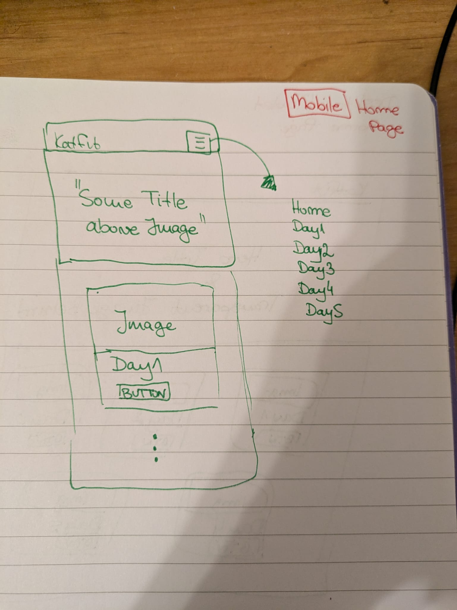
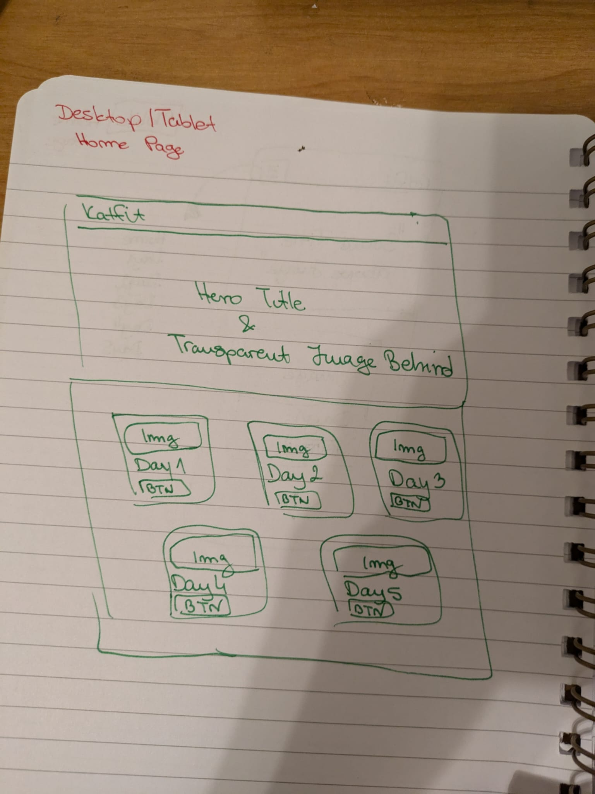
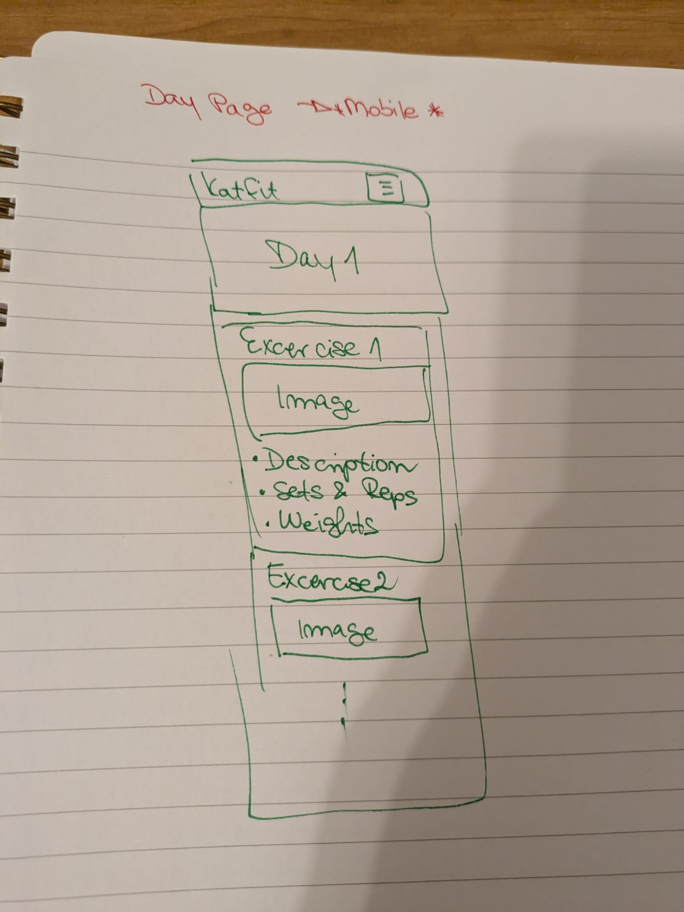
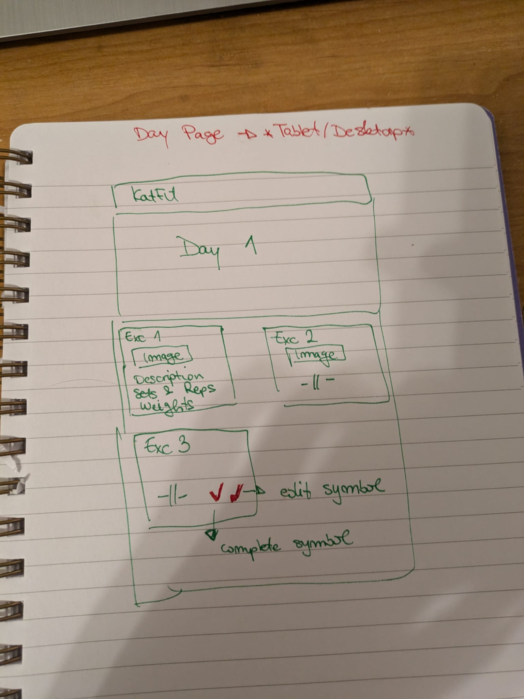
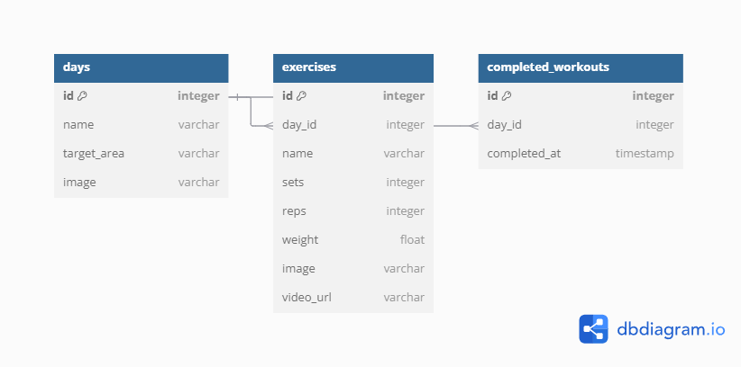

## KatFit

## Overview

KatFit is a personalized workout planner designed to help me efficiently track and stick to a structured 5-day workout routine. The app provides a pre-set plan with each day dedicated to specific focus areas—legs, core, upper body, and more.  By providing clear structure of workouts, I can focus on achieving my fitness targets without losing track of my planned excercises. 

### Problem Space

Some times I find myself forgetting what excercises I planned for the day, the number of reps or weights I used in previous workouts. Without clear record, it can be challenging to track progress and stay focused on fitness goals. KatFit will help me stay organized and mantain focus.  

### User Profile

KatFit is primarily designed for my personal use. As the sole user, I will utilize the app to stay consistent to my fitness goals. Also, I will be able to review my past workouts to track progress and make adjustments as needed.

### Features

1. **5-Day Workout Routine**:
   - KatFit provides a structured 5-day workout plan, with each day focusing on different muscle groups.

2. **Daily Exercise Display**:
   - When a user selects a specific day, the app displays the exercises planned for that day, including details such as exercise type, number of sets, and reps.

3. **Reps and Weights Customization**:
   - Users can adjust the number of reps and weights for each exercise.

4. **Completion Tracking**:
   - Users can mark each day's workout as complete with a simple checkmark or indicator to track their progress.


## Implementation

### Tech Stack

**Frontend:**
- React
- JavaScript
- SCSS

**Backend:**
- Express
- MySQL

**Client Libraries:**
- react
- react-router
- axios

**Server Libraries:**
- knex
- express

### APIs

- No external APIs will be used for the first sprint

### Sitemap

### Home Page
- **URL**: `/` (Root URL)
- **Description**: Lists the days of the workout routine (Day 1, Day 2, Day 3, Day 4, Day 5) as clickable items.

### Day Pages
- **URL**: `/days/{day_id}`
- **Description**: Each day page dynamically loads content based on the selected day. Here are the routes for each day:
- **Example**
    - **Day 1**: `/days/1`
    - **Day 2**: `/days/2`
    - **Day 3**: `/days/3`
    - **Day 4**: `/days/4`
    - **Day 5**: `/days/5`


### Mockups






### Data



### Endpoints

**GET /days** : Fetch all workout days.
- `PARAMETERS:` **None**
- `RESPONSE:`
```
{
"id": 1,
"name": "Day 1",
"target_area": "Legs",
"image": "legs-image.jpg"
},
{
"id": 2,
"name": "Day 2",
"target_area": "Upper Body",
"image": "upper-body-image.jpg"
},..
```

**GET /days/{day_id}** : Fetch details of a specific workout day, including the exercises.
- `PARAMETERS`: **day_id**
- `RESPONSE:`
```
{
"id": 1,
"name": "Day 1",
"image": "legs-image.jpg",
"exercises": [
{
"id": 1,
"name": "Goblet Pause Squat",
"sets": 4,
"reps": 102,
"weight": 34,
"image": "goblet-pause-squat.jpg",
"video_url": "https://www.youtube.com/embed/8jeMsehQJK0?si=37Odhhqy6TbxzavM"
},
{
"id": 2,
"name": "Goblet Squat",
"sets": 3,
"reps": 1299,
"weight": 345,
"image": "goblet-squat.jpg",
"video_url": "https://www.youtube.com/embed/pEGfGwp6IEA?si=VPod2jWtvqiZhkNS"
},...
```

**PUT /exercises/{exercise_id}** : Update details of an excercise (e.g., changing value of sets, reps, weight)
- `PARAMETERS`: **exercise_id**
- `RESPONSE:`
```
{
  "id": 1,
  "name": "Squats",
  "sets": 4,
  "reps": 12,
  "weight": 65
}
```

## Roadmap

**SETUP & INITIALIZATION** ~ `2 day`
- `Repository Setup`
    - Create and initialize seperate repos for front-end and back-end.
- `Folder Structure`
    - Create folders for both front-end and back-end.
- `Database Setup`
    - Design and create database schema.
    - Set up migration files
    - Seeding of the database with created data.

**FRONT END** ~ `4 days`
- `Header component`
    - Design and implement responsive header component
- `Hero section`
    - Design and implement responsive hero section of the home page.
- `Days section`
    - Design and implement responsive section that displays workout days.
- `Footer component`
    - Design and implement responsive footer component.

**BACK END** ~ `4 days`
- `API Endpoints`
- `Integration`
    - Integrate front-end with back-end APIs.

**TESTING** ~ `1 day`
- Making sure everything works well of both front-end and back-end components.


---

## Future Implementations

1. **Routine Modification**:
   - Users will have the option to modify the default 5-day workout plan, including adding or removing exercises and changing the workout focus.

2. **User Accessibility**:
   - KatFit will be expanded to accommodate multiple users. This will involve implementing user accounts and personalized settings.

